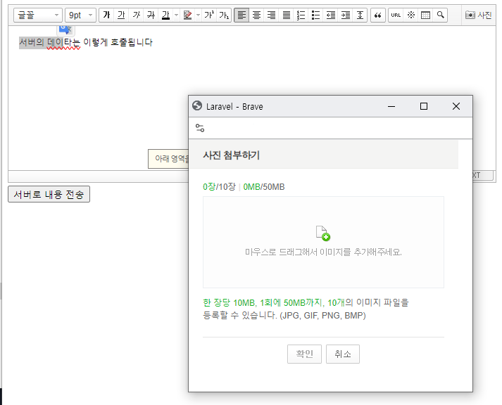

# NAVER SMART Editor for Laravel

## document

[공식사이트](https://www.onstory.fun/doc/programming/laravel/package.laraveleditor)


## Installation
```
composer require wangta69/laravel-editor
php artisan editor:install
```

## Tests
> goto https://yourdomain/editor/smart-editor


## Ex
### before
```
<form>
  <textarea name="comment"></textarea>
  <button type="submit">Save</button>
</form>
```
### after
```
<form>
  @include ('editor::smart-editor.editor', ['name'=>'comment', 'id'=>'comment-id', 'value'=>'', 'attr'=>['class'=>'']])
  <button type="submit">Save</button>
</form>
```


- for more [visit](https://www.onstory.fun/doc/programming/laravel/package.laraveleditor)


  