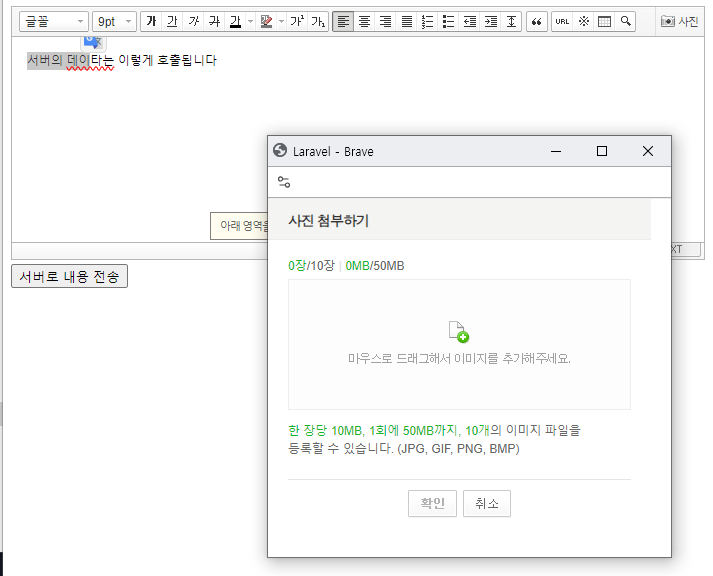

# 🚀 Laravel WYSIWYG Editor Hub

> **현재 배포 중인 주요 웹 에디터들을 라라벨 프로젝트에서 즉시 사용할 수 있도록 통합한 플러그인입니다.**  
> 복잡한 설정 없이 설정값 하나로 TinyMCE, Naver Smart Editor 등 다양한 에디터를 교체하며 사용할 수 있습니다.

---

## 🌟 Real-world Usage

이 라이브러리는 **[길라(Gilra)](https://gilra.kr)** (Online Fortune Service)의 커뮤니티 게시판, 1:1 상담소, 그리고 공지사항 기능을 구축하는 데 실제로 사용되어 안정성이 검증되었습니다.

---

## ✨ Key Features

- **Multi-Editor Support**: 하나의 패키지로 4종 이상의 유명 에디터 지원
- **Simple Integration**: Blade 디렉티브나 컴포넌트로 간편하게 삽입
- **Image Upload Ready**: 이미지 업로드를 위한 전용 Trait 제공 (`SmartEditor`)
- **Flexible Configuration**: 에디터 전환, 경로 설정, 미들웨어 설정을 한 곳에서 관리

---

## 📚 Documentation

상세한 사용법과 커스텀 가이드는 [공식 사이트](https://www.onstory.fun/doc/programming/laravel/package.laraveleditor)에서 확인하실 수 있습니다.

---

## 🛠 Installation

### 1. Composer를 통해 설치

```bash
composer require wangta69/laravel-editor
```

### 2. 에디터 리소스 및 설정파일 발행

```bash
php artisan pondol:install-editor
```

_이 명령어를 실행하면 `config/pondol-editor.php` 파일과 `public/plugins/editor` 폴더에 필요한 정적 파일들이 생성됩니다._

---

## ⚙️ Configuration

`config/pondol-editor.php` 파일에서 기본으로 사용할 에디터 템플릿과 라우팅 옵션을 수정할 수 있습니다.

### Supported Templates

| Key            | Editor Name                | Description                                  |
| :------------- | :------------------------- | :------------------------------------------- |
| `richtext`     | **RichText Editor**        | 가볍고 빠른 기본 에디터 (Default)            |
| `tinymce`      | **TinyMCE**                | 전 세계적으로 가장 많이 쓰이는 강력한 에디터 |
| `smart-editor` | **Naver Smart Editor 2.0** | 국내 사용자에게 친숙한 네이버 스타일         |
| `froala`       | **Froala Editor**          | 세련된 디자인과 모바일 최적화 에디터         |

---

## 📖 Usage Examples

### 1. 기본 사용법 (Default Template)

설정파일에 지정된 기본 에디터를 불러옵니다.

**Before:**

```html
<form>
  <textarea name="comment"></textarea>
</form>
```

**After:**

```html
<form>
  <x-editor-components name="comment" id="comment-id" value="초기 내용" />
  <button type="submit">저장하기</button>
</form>
```

### 2. 특정 에디터 강제 지정

기본 설정과 상관없이 페이지마다 다른 에디터를 사용하고 싶을 때 유용합니다.

**TinyMCE 적용 시:**

```html
@include('editor::tinymce.editor', [ 'name' => 'comment', 'id' => 'comment-id',
'value' => $data->content, 'attr' => ['class' => 'form-control'] ])
```

---

## 📸 Image Upload (SmartEditor Trait)

이미지 업로드 로직을 직접 짤 필요가 없습니다. 컨트롤러에 `SmartEditor` Trait을 추가하세요.

```php
use Pondol\Editor\Traits\SmartEditor;

class PostController extends Controller
{
    use SmartEditor;

    public function uploadImage(Request $request)
    {
        // _uploadStore 메서드가 유효성 검사 및 저장을 자동으로 처리합니다.
        $result = $this->_uploadStore($request, 'uploads/posts');
        return $result['url'];
    }
}
```

---

## 🧪 Tests & Verification

설치 후 아래 주소로 접속하여 에디터가 정상적으로 렌더링되는지 즉시 테스트할 수 있습니다.

- **기본 테스트**: `https://your-domain.com/editor/richtext`
- **스마트 에디터**: `https://your-domain.com/editor/smart-editor`

---

## 🖼 Screenshots


_다양한 환경에서 일관된 편집 경험을 제공합니다._

---

## 🤝 Contribution & Support

- **Issues**: 버그나 개선 사항은 [GitHub Issues](https://github.com/wangta69/laravel-editor/issues)에 남겨주세요.
- **Support**: [onstory.fun](https://www.onstory.fun)

---

Copyright © wangta69. Licensed under the MIT License.
